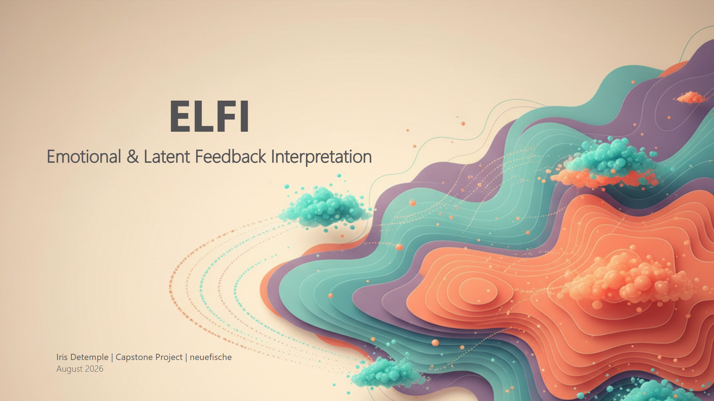

# ELFI – Emotional & Latent Feedback Interpretation



## Summary

ELFI is a solution for analysing **German-language employee survey comments** through sentiment analysis and topic discovery. The goal is to transform large volumes of qualitative feedback into structured, actionable insights.

The solution combines modern Natural Language Processing (NLP) techniques with Power BI reporting. Comments are extracted from a defined data source, analysed using multiple NLP models, and written back into a separate target table. The analysis covers both the emotional content of the comments and the topics employees discuss.

The project supports data-informed organisational development by helping leaders and HR professionals interpret employee feedback at scale. In the long term, the approach is intended to become a reusable and automated analysis component that can be applied to other survey formats.

---

## The Goal

Every free-text comment should ultimately become a point in a two-dimensional affect space:

- **How pleasant is the experience?** (Valence)
- **How activated is the experience?** (Arousal)

Together, these dimensions form the circumplex model of affect proposed by Russell (1980) and later refined within the Core Affect framework (Barrett & Russell, 1999).

Both dimensions are needed because a single sentiment score is not sufficient. For example, a comment expressing *tension* reflects negative valence and high activation, whereas a comment expressing *resignation* reflects negative valence and low activation. Both indicate dissatisfaction, but they describe very different situations. This distinction can be highly relevant in employee-feedback analysis.

The notebooks follow the construction of these measures step by step:

| | Notebook | Question |
|---|---|---|
| **01** | **the data** | **what are these responses, and what does cleaning do?** |
| **02** | measuring valence | can the pleasantness axis be measured in free text? |
| **03** | measuring arousal | can the activation axis be measured too? |
| **04** | the circumplex | what do both axes show together? |
| **05** | topics and engagement | what do people write about, and does language predict engagement? |
| **06** | the pipeline | all winning models, one file in, dashboard out |
| **07** | *a data-driven axis* — add-on | *is there a better second axis hidden in the survey answers themselves?* |

The short answer is given here so that the notebooks can be read as evidence rather than suspense:

**Valence works. Arousal works only partly.**

Notebook 03 documents why.

Each notebook asks a single question and answers it at the end.

**Notebook 07 is an experimental side piece, not part of the chain.** It asks whether a better second axis could be derived from the survey answers themselves, in the sense of Warr's rotated criterion, rather than assembled from a word list. The answer is no: the axis it finds explains too little, and what it does find is largely valence again — the dimension that was already solid. It is included because a negative result is still a result, and because it documents what was tried before settling for the word-list measure. Nothing downstream depends on it, and the pipeline runs without it.

---

## The dashboard, without running anything

Notebook 06 exports a Power BI model. A built version of it is in
[`synthetic_dashboard/`](synthetic_dashboard/), so the result can be looked at without
installing Python or running the chain:

```
synthetic_dashboard/
├── dashboard_synthetic_presentation.pbix    open this
├── fact_antworten.csv                       one row per questionnaire
├── fact_dichte.csv                          the smoothed density field
└── dim_*.csv                                business unit, division, iteration,
                                             corner, theme
```

It needs **Power BI Desktop**, which is free and Windows-only. The `.pbix` carries its
own copy of the data, so it opens without the CSVs — those are there for anyone who
wants the tables rather than the report.

**It runs on the synthetic dataset**, like everything else that is published here. The
distributions are therefore the generator's, not an organisation's. What the file
demonstrates is the model behind the report: a star schema, a bridge table for the
company themes, and the measures — including the suppression rule that returns blank
for any selection under five respondents.

---

## About the Data Used Here

**The published version of these notebooks runs on a synthetic dataset.**

The original survey contains identifiable employee feedback and cannot be shared. An executed version using real data carries genuine employee comments in its notebook outputs and is therefore not distributed.

The synthetic replacement was generated to preserve the relationships on which the analysis depends, including:

- the relationship between text valence and closed survey items,
- the relationship between comment length and engagement,
- the independence of the two affect dimensions.

Two aspects were intentionally changed and are discussed wherever they affect the analysis:

1. **The sentiment distribution differs from the real dataset.** The shape of the real distribution is itself an organisational finding and was therefore not reproduced.

2. **The comments describe different departments and situations.** No original comments were copied. As a result, the topics identified in the synthetic data differ from those reported for the real survey.

What carries over between the two datasets and what does not is discussed where it
matters: the **order** in which the methods rank is stable, the **effect sizes** are
not. Generated text carries a clearer signal than real feedback, so the numbers here
come out friendlier throughout. [METHOD.md](notebooks/METHOD.md) says this per step.

---

## 📑 Table of Contents

* [**Setup**](SETUP.md) — Python environment, Ollama, and where the data folder goes
* [**The method, step by step**](notebooks/METHOD.md) — what each notebook does, what
  comes out, what it is validated against, and the quality measures in plain terms
* [Project Description](project_setup/project_description.md)
* [Decision Log](project_setup/decision_log.md)

*Sources*

* [References, Models and Tools](REFERENCES.md)

---

---

## 🛠️ Setup

**Read [SETUP.md](SETUP.md) before running anything.** It covers the Python
environment, the optional Ollama installation, and — most easily overlooked — where the
data folder has to sit and which two files are not part of this repository.

The short version:

```
your-clone/
├── notebooks/             the seven notebooks
├── synthetic_dataset/     the data they read — must sit next to notebooks/
└── synthetic_dashboard/   the built report, needs no Python
```

Everything else is in [SETUP.md](SETUP.md).

---

## Licence and credit

**Code — MIT.** The code cells in the notebooks and any scripts. Use it, change it,
build on it; keep the notice with the source. See [LICENSE](LICENSE).

**Everything else — CC BY 4.0.** The README, [SETUP.md](SETUP.md), the process
documentation, the prose in the notebooks, the figures and the synthetic dataset.
Free to share and adapt, including commercially, as long as it is credited. See
[LICENSE-DOCS](LICENSE-DOCS).

If you use any of it, this is the credit line I would like:

```
ELFI — Emotional & Latent Feedback Interpretation, Iris Detemple,
https://github.com/IzziePy/ELFI-capstone, CC BY 4.0
```

For a formatted citation, GitHub's **Cite this repository** button reads
[CITATION.cff](CITATION.cff) and will give you APA or BibTeX.

And a request rather than a requirement: **if you build something on this, I would
genuinely like to hear about it.** Open an issue — I am curious what other people do
with it, and a note costs you a minute.

Two things neither licence covers. The **models** (Gemma 2, german-sentiment-bert,
German-Emotions, the sentence-transformer) and the **affective word lists** (BAWL-R,
the IMS Stuttgart norms) carry their own terms and are not redistributed here. Sources
and conditions are in [REFERENCES.md](REFERENCES.md).
